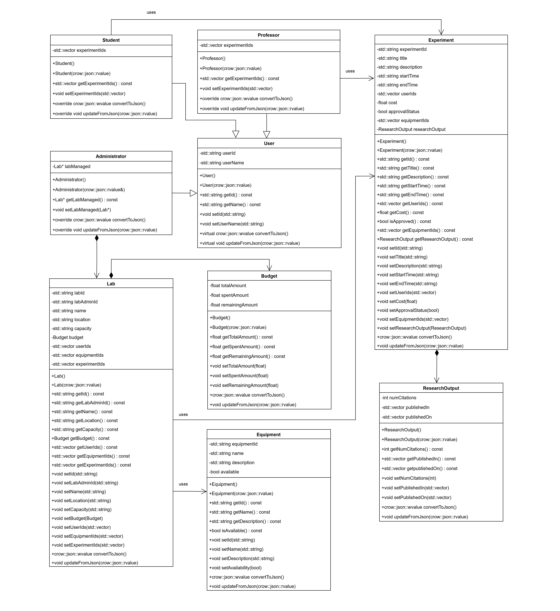

# Project Design Document

## Introduction
LabFlow API supports lab mangement operations for administrators, professors, students, and guests by providing various features such as Lab reservation system, equipment tracking, scheduling, budget and expense tracking, logging research outputs, etc. It allows for user registration with different levels of access. Additionally, students can propose experiments and check if labs and equipment are available. Overall, this system aims to improve the efficiency of lab management and support everyone involved.

## Background/Context
Laboratories are vital to academic institutions and research centres. They require extensive planning and coordination to maintain equipment, manage budget, schedule lab sessions, and record research outputs. Traditionally, lab management processes are done by manual tracking and they often have scheduling conflicts. LabFlow API addresses these issues by integrating all lab management operations into a single system that allows users to interact with lab resources according to their need. Further, the API allows the lab to have an extent to which a user can interact with the lab resources. This functionality helps improve the security of the lab.

## Stakeholders
* **Administrators:** Individuals who use this API for managing lab operations, resources, and user access. They are interested in control over budget, equipment, and user roles.
* **Professors:** Individuals who use this API to oversee experiments and ensure alignment with academic and research goals. They use this API to approve experiments and manage research outputs.
* **Students:** Individuals who can propose and do experiments in the lab but have limited access to the details of the lab resources and equipment. They can collaborate  with professors to work on an experiment.
* **Guests:** Individuals who are visitors to the lab or have temporary collaborations. They require minimal interaction with lab resources but are interested in knowing about the research output of the lab.

## Functional Requirements
1. Resource Creation
    * The service shall allow administrators to create new labs via POST requests.
    * The service shall allow professors and students to create new experiments via POST requests.
    * The service shall allow administrators to create new users for the lab via POST requests.
    * The service shall allow administrators and professors to create new equipments via POST requests.
    * The service shall validate all incoming data against predefined schemas before creating a new resource.
    * The service shall return a 201 Created status code and the created resource in the response body upon successful creation.

2. Resource Retrieval
   * The service shall provide endpoints for users of any level to retrieve lists of experiments, equipments, and users in the lab via GET requests.
   * The service shall allow retrieval of detailed information for a single resource by its unique identifier.
   * The service shall return a 200 OK status code and the requested resources in the response body upon successful retrieval.

3. Resource Update
   * The service shall permit administrators, professors, and students to update existing resource entries for experiments and equipments via PUT requests.
   * The service shall validate all incoming data for updates against predefined schemas.
   * The service shall return a 200 OK status code and the updated resource in the response body upon successful update.

4. Resource Deletion
   * The service shall enable administrators and professors to delete resource entries for experiments and equipments via DELETE requests.
   * The service shall return a 204 No Content status code upon successful deletion.
   * The service shall return a 403 Forbidden status code if an unauthorized user attempts to delete a resource.
  
5. Data Validation
   * The service shall enforce data validation rules to ensure that all resource data conforms to the expected formats, types, and constraints.
   * The service shall return a 400 Bad Request status code along with error details if validation fails.

6. Authentication and Authorization   
   * The service shall require authentication for users attempting to create, update, or delete resources.
   * The service shall authorize users based on their roles, permitting only authorized users to modify or delete resource entries.

7. Error Handling
   * The service shall implement comprehensive error handling to provide meaningful error messages and appropriate HTTP status codes to the client for all failed operations.
   * The service shall return a 404 Not Found status code when a requested resource cannot be located.
   * The service shall return a 500 Internal Server Error status code in the event of unexpected server-side errors.


## Use Case Description

#### User
* Create (POST)
  * As a lab administrator, I want to create new user accounts to allow researchers, students, and guests to access the lab with proper permissions.
* Read (GET)
  * As a lab administrator, I want to view a list of all users or specific user profiles to monitor and manage lab access.
  * As a professor and a student, I want to view my own user profile to ensure my details are up-to-date.
* Update (PUT)
  * As a lab administrator, I want to update user details (e.g., roles, contact information) to reflect changes in staff assignments or access levels.
* Delete (DELETE)
  * As a lab administrator, I want to remove users who are no longer part of the lab to maintain an accurate and secure user database.
  * As a professor, I want to remove students who are no longer working with my research group.

#### Lab
* Create (POST)
  * As a lab administrator, I want to create new lab entries to represent different laboratories under management.
* Read (GET)
  * As a professor and a student, I want to view details of the lab to understand its resources and schedule.
  * As a lab administrator, I need to retrieve lab information to monitor capacity, budget, and overall operations.
  * As a guest, I want to see basic information about the lab, such as its location and availability.
* Update (PUT)
  * As a lab administrator, I want to update lab details (e.g., capacity, budget) to reflect changes in lab operations or policies.
* Delete (DELETE)
  * As a lab administrator, I want to remove lab entries that are no longer active to maintain an accurate database.

#### Equipment
* Create (POST)
  * As a lab administrator, I want to add new equipment to the lab to ensure accurate tracking of lab resources.
  * As a professor, I want to add new equipment to the lab for research purpose.
* Read (GET)
  * As a professor and a student, I want to view available equipment to plan my experiments accordingly.
  * As a lab administrator, I need to retrieve a list of all equipments to monitor inventory and usage trends.
  * As a guest, I want to see the equipments that the lab has.
* Update (PUT)
  * As a lab administrator, I want to update equipment details (e.g., availability) to keep the database updated and accurate.
* Delete (DELETE)
  * As a lab administrator, I want to remove equipment that is no longer operational in the lab.

#### Experiment
* Create (POST)
  * As a professor and a student, I want to create new experiments in the lab.
* Read (GET)
  * As a professor and a student, I want to view my experiments to monitor progress and access details for analysis.
  * As a lab administrator, I need to review experiments to ensure compliance with safety protocols and resource allocation policies.
  * As a guest, I want to see the experiments that are being conducted in the lab.
* Update (PUT)
  * As a professor and a student, I want to update experiment details (e.g., description, results, etc) to reflect ongoing
    developments or corrections in my work.
* Delete (DELETE)
  * As a professor, I want to remove experiments that are canceled or irrelevant to my research area.
  * As a lab administrator, I want to remove experiments for which the lab doesn't have sufficient funding.

## List Of Resources
* **User:** An individual who interacts with lab (administrator, professor, student, guest)
* **Lab:** A representation of a physical laboratory space
* **Equipment:** A physical medium that represents tools and devices available in the lab
* **Experiment:** A model of an experiment
* **ResearchOutput:** A digital medium that represents experiment results and publications
* **Budget:** A digital medium that represents expenses and budget allocations associated with the lab
* **TimeSlot:**

## List of End Points
In the context of this API, {id} would typically be replaced by a unique identifier for the resource, such as a string or a number that uniquely identifies a user, experiment, or equipment.

### User
* **POST** `/api/users`
  * **Description:** Create a new user.
  * **Request BODY:** 
    ```JSON
    {
        "userID":"1", 
        "username":"varun", 
        "password":"noneForNow", 
        "email":"none@gmail.com", 
        "firstName":"Varun", 
        "lastName":"Rayamajhi", 
        "idsOfExperimentsBooked":[
            "123"
        ]
    }
    ```
  * **Response:** `201 Created` with the created user object in the body.
  * **Error:** `400 Bad Request` if input validation fails
  
* **GET** `/api/users`
  * **Description:** Retrieve a list of all users.
  * **Response:** `200 OK` with an array of user objects in the body.
  * **Error:** `403 Forbidden` if the user is unauthorized.

* **GET** `/api/users/{id}`
  * **Description:** Retrieve details of a specific user.
  * **Response:** `200 OK` with the user object in the body.
  * **Error:** `404 Not Found` if the user doesn't exist;  `403 Forbidden` if the user is unauthorized.

* **PUT** `/api/users/{id}`
  * **Description:** Update an existing user.
  * **Request BODY:** 
    ```JSON
    {
        "userID":"1", 
        "username":"varun", 
        "password":"noneForNow", 
        "email":"none@gmail.com", 
        "firstName":"Varun", 
        "lastName":"Rayamajhi", 
        "idsOfExperimentsBooked":[
            "123"
        ]
    }
    ```
  * **Response:** `200 OK` with the updated user object in the body.
  * **Error:** `400 Not Found` if the user doesn't exist; `400 Bad Request` if input validation fails; `403 Forbidden` if the user is unauthorized.

* **DELETE** `/api/users/{id}`
  * **Description:** Delete a specific user.
  * **Response:** `404 No Content`.
  * **Error:** `404 Not Found` if the user doesn't exist; `403 Forbidden` if the user is unauthorized.

### Lab
* **POST** `/api/labs`
  * **Description:** Create a new lab.
  * **Request BODY:**
    ```JSON
    {
      "labID" : "1",
      "name" : "Physics Lab",
      "location" : "Gottwald",
      "capacity" : "24",
      "budget" : "15000",
      "availability" : "available",
      "equipmentIDs" : ["767", "290"],
      "experimentIDs" : ["486", "244"],
      "bookedBy" : ["12"]
    }
    ```
  * **Response:** `201 Created` with the created lab object in the body.
  * **Error:** `400 Bad Request` if input validation fails.
  
* **GET** `/api/labs`
  * **Description:** Retrieve a list of all labs.
  * **Response:** `200 OK` with an array of lab objects in the body.
  * **Error:** `403 Forbidden` if the user is unauthorized.

* **GET** `/api/labs/{id}`
  * **Description:** Retrieve details of a specific lab.
  * **Response:** `200 OK` with the specific lab object in the body.
  * **Error:** `403 Forbidden` if the user is unauthorized; `404 Not Found` if the lab doesn't exist.

* **PUT** `/api/labs/{id}`
  * **Description:** Update an existing lab.
  * **Request BODY:**
    ```JSON
    {
      "labID" : "1",
      "name" : "Nuclear Physics Lab",
      "location" : "Gottwald",
      "capacity" : "24",
      "budget" : "25000",
      "availability" : "available",
      "equipmentIDs" : ["695", "589", "987"],
      "experimentIDs" : ["256", "747", "380"],
      "bookedBy" : ["12", "85"]
    }
    ```
  * **Response:** `200 OK` with the updated lab object in the body.
  * **Error:** `404 Not Found` if the lab doesn't exist; `400 Bad Request` if input validation fails; `403 Forbidden` if the user is unauthorized.

* **DELETE** `/api/labs/{id}`
  * **Description:** Delete a specific lab.
  * **Response:** `204 No Content`
  * **Error:** `404 Not Found` if the lab doesn't exist; `403 Forbidden` if the user is unauthorized.

### Equipment
* **POST** `/api/equipments`
  * **Description:** Create a new equipment.
  * **Request BODY:** 
    ```JSON
    {
        "equipmentId" : "34",
        "name" : "Vernier Calipers",
        "cost" : "3909",
        "description" : "Measurement tool",
        "availability" : "available",
        "idsOfExperimentsUsingIt" : [
            "456"
        ]
    }
    ```
  * **Response:** `201 Created` with the created equipment object in the body.
  
* **GET** `/api/equipments`
  * **Description:** Retrieve a list of all equipments.
  * **Response:** `200 OK` with an array of equipment objects in the body.
  * **Error:** `403 Forbidden` if the user is unauthorized.

* **GET** `/api/equipments/{id}`
  * **Description:** Retrieve details of a specific equipment.
  * **Response:** `200 OK` with the equipment object in the body.
  * **Error:** `404 Not Found` if the user doesn't exist;  `403 Forbidden` if the user is unauthorized.

* **PUT** `/api/equipments/{id}`
  * **Description:** Update an existing equipment.
  * **Request BODY:** 
    ```JSON
    {
        "equipmentId" : "34",
        "name" : "Vernier Calipers",
        "cost" : "3909",
        "description" : "Measurement tool",
        "availability" : "available",
        "idsOfExperimentsUsingIt" : [
            "456"
        ]
    }
    ```
  * **Response:** `200 OK` with the updated equipment object in the body.
  * **Error:** `400 Not Found` if the equipment doesn't exist; `400 Bad Request` if input validation fails; `403 Forbidden` if the user is unauthorized.

* **DELETE** `/api/equipments/{id}`
  * **Description:** Delete a specific equipment.
  * **Response:** `404 No Content`.
  * **Error:** `404 Not Found` if the equipment doesn't exist; `403 Forbidden` if the user is unauthorized.
  
### Experiment
* **POST** `/api/experiments`
  * **Description:** Create a new experiment.
  * **Request BODY:** 
    ```JSON
    {
        "experimentId" : "125",
        "title" : "Measuring the value of g",
        "description" : "We will measure the value of g.",
        "date" : "11/15/2024",
        "userIDs" : [
            "123"
        ],
        "cost" : "345",
        "approval" : "approved",
        "idsOfEquipmentsUsed" : [
            "456"
        ],
        "researchOutput" : {
            "numberOfCitations" : "258",
            "publishedIn" : [
                "Journal 1"
            ],
            "publicationDate" : [
                "11/19/2024"
            ]
        },
        "timeSlot" : {
            "startTime" : "1200",
            "endTime" : "1800"
        }
    }
    ```
  * **Response:** `201 Created` with the created experiment object in the body.
  
* **GET** `/api/experiments`
  * **Description:** Retrieve a list of all experiments.
  * **Response:** `200 OK` with an array of experiment objects in the body.
  * **Error:** `403 Forbidden` if the user is unauthorized.

* **GET** `/api/experiments/{id}`
  * **Description:** Retrieve details of a specific experiment.
  * **Response:** `200 OK` with the experiment object in the body.
  * **Error:** `404 Not Found` if the experiment doesn't exist;  `403 Forbidden` if the user is unauthorized.

* **PUT** `/api/experiments/{id}`
  * **Description:** Update an existing experiment.
  * **Request BODY:** 
    ```JSON
    {
        "experimentId" : "125",
        "title" : "Measuring the value of g",
        "description" : "We will measure the value of g.",
        "date" : "11/15/2024",
        "userIDs" : [
            "123"
        ],
        "cost" : "345",
        "approval" : "approved",
        "idsOfEquipmentsUsed" : [
            "456"
        ],
        "researchOutput" : {
            "numberOfCitations" : "258",
            "publishedIn" : [
                "Journal 1"
            ],
            "publicationDate" : [
                "11/19/2024"
            ]
        },
        "timeSlot" : {
            "startTime" : "1200",
            "endTime" : "1800"
        }
    }
    ```
  * **Response:** `200 OK` with the updated experiment object in the body.
  * **Error:** `400 Not Found` if the experiment doesn't exist; `400 Bad Request` if input validation fails; `403 Forbidden` if the user is unauthorized.

* **DELETE** `/api/experiments/{id}`
  * **Description:** Delete a specific experiment.
  * **Response:** `404 No Content`.
  * **Error:** `404 Not Found` if the experiment doesn't exist; `403 Forbidden` if the user is unauthorized.

#### Error Handling Strategies
* **Validation Errors:** Respond with `400 Bad Request` and include the error details.
* **Authentication/Authorization Errors:** Utilize `401 Unauthorized` for authentication issues and `403 Forbidden` for authorization issues.
* **Not Found Errors:** Use `404 Not Found` when a resource cannot be located.
* **Server Errors:** Respond with `500 Internal Server Error` for unexpected server-side issues.

This API will also use standard HTTP status codes to communicate the outcome of API requests, ensuring that clients can handle responses appropriately.

## UML Diagrams
